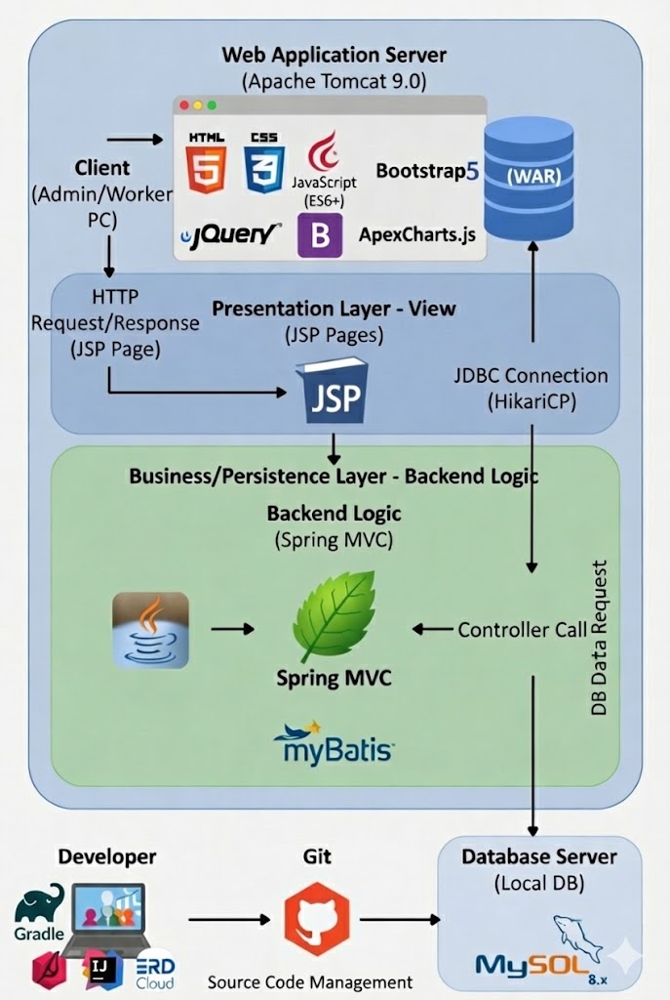
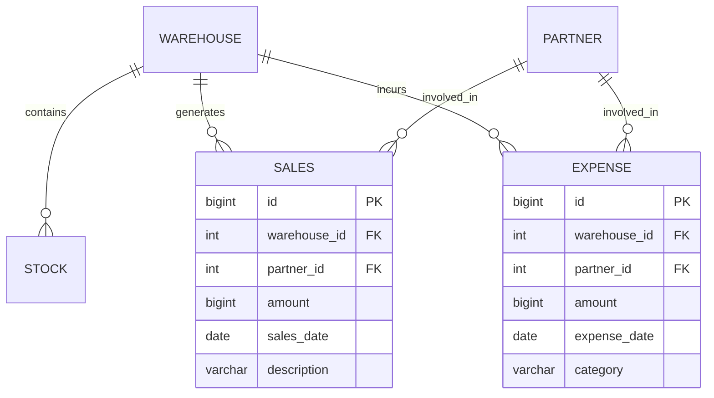

# 📦 RACL - 의류 중심 창고관리 시스템 (WMS)

<div align="center">


**팀명:** 빌더스 (Builders) | **팀 규모:** 6명

**개발 기간:** 2025.11.07 ~ 2025.11.14 (8일)

**담당 파트:** 📊 대시보드 시각화 & 💰 재무관리 시스템

</div>

---

## 📑 목차
- [프로젝트 소개](#-프로젝트-소개)
- [기술 스택](#-기술-스택)
- [시스템 아키텍처](#-시스템-아키텍처-architecture)
- [데이터베이스 설계 (ERD)](#-데이터베이스-설계-erd)
- [나의 담당 기능](#-나의-담당-기능)
- [트러블 슈팅 로그](#-트러블-슈팅-troubleshooting-log)
- [프로젝트 구조](#-프로젝트-구조)
- [회고](#-회고)

---

## 🎯 프로젝트 소개

**RACL**은 의류 산업에 특화된 창고관리 시스템(Warehouse Management System)입니다.

실시간 재고 추적, 입출고 관리, 데이터 시각화를 통해 효율적인 물류 운영을 지원합니다.

### 💡 기획 배경
- 의류 업계의 복잡한 SKU 관리 및 시즌별 재고 변동 대응
- 실시간 매출/비용 분석을 통한 경영 의사결정 지원
- 직관적인 대시보드로 비전문가도 쉽게 이해할 수 있는 UI 제공

### 🎨 나의 역할
저는 **관리자 대시보드 시각화**와 **재무관리(매출/지출) 시스템**을 전담하여 개발했습니다.

특히 복잡한 통계 데이터를 시각적으로 표현하고, RESTful API 구조로 확장 가능한 재무 CRUD를 구현하는 데 집중했습니다.

---

## 🛠 기술 스택

### Backend
- **Language:** Java 17
- **Framework:** Spring MVC 5.x
- **ORM:** MyBatis 3.x
- **Build Tool:** Gradle
- **WAS:** Apache Tomcat 9.0
- **Connection Pool:** HikariCP

### Frontend
- **Core:** HTML5, CSS3, JavaScript (ES6+)
- **Library:** jQuery 3.x, Bootstrap 5
- **Visualization:** ApexCharts.js 3.x

### Database
- **DBMS:** MySQL 8.x
- **Design Tool:** ERD Cloud

---

## 🏗️ 시스템 아키텍처 (Architecture)
> **Spring MVC 패턴을 기반으로 한 전체 시스템 데이터 흐름도입니다.**



- **Presentation Layer:** JSP와 Bootstrap을 활용하여 사용자 요청(Request)을 처리하고 뷰(View)를 렌더링합니다.
- **Business Layer:** Spring MVC 컨트롤러와 서비스가 비즈니스 로직을 수행합니다.
- **Persistence Layer:** MyBatis를 통해 SQL 매퍼와 객체를 매핑하여 DB 데이터를 조작합니다.

---

## 🗄️ 데이터베이스 설계 (ERD)
> **재무 관리 및 대시보드 통계를 위한 핵심 테이블 구조입니다.**



---

## 💼 나의 담당 기능

### 1. 📊 관리자 대시보드 (Dashboard)

창고 운영의 핵심 지표를 **ApexCharts**로 시각화하여 한눈에 파악할 수 있도록 구현했습니다.

* **KPI 분석:** 연간/월간 손익 데이터를 집계하여 순이익(Net Profit)과 이익률(Profit Margin) 자동 계산
* **성장률 지표:** 전월(MoM), 전년(YoY) 대비 성장률을 산출하는 비즈니스 로직 구현
* **시각화:** Bar, Line, Radial Bar, Donut 차트를 활용한 직관적 UI 제공

### 2. 💰 재무 관리 시스템 (Sales & Expense)

창고 운영에서 발생하는 매출과 비용을 체계적으로 관리하는 CRUD 시스템입니다.

* **RESTful API:** `/api/sales`, `/api/expenses` 등 자원 중심의 URL 설계
* **데이터 무결성:** 창고(Warehouse) 및 거래처(Partner) FK 제약조건 준수 및 유효성 검사
* **필터링:** 연도/월별 동적 쿼리(Dynamic Query)를 통한 데이터 조회

---

## 🚒 트러블 슈팅 (Troubleshooting Log)

> **프로젝트 진행 중 발생한 주요 기술적 이슈와 해결 과정입니다. (클릭하여 상세보기)**

<details>
<summary>👉 <b>1. 대시보드 데이터 집계 성능 최적화 (N+1 문제 해결)</b></summary>

**[문제 상황]**

* 초기에는 1월부터 12월까지의 매출/지출 데이터를 각각 조회하는 루프를 돌려, 페이지 로딩 시 총 **24번의 쿼리**가 실행됨.
* 이로 인해 대시보드 진입 시 2~3초의 로딩 지연 발생.

**[해결 과정]**

* **쿼리 최적화:** MyBatis에서 `GROUP BY`를 사용하여 연간 데이터를 **단 2번**의 쿼리로 조회.
* **Java Stream API:** DB에서 가져온 데이터를 메모리 상에서 매핑하여 연산.

```sql
<select id="selectYearlySales" resultType="SalesVO">
    SELECT MONTH(sales_date) as month, SUM(amount) as totalAmount
    FROM sales
    WHERE YEAR(sales_date) = #{year}
    GROUP BY MONTH(sales_date)
</select>

```

**[결과]**

* 쿼리 횟수 **92% 감소** (24회 → 2회) 및 로딩 속도 **0.4초**로 단축.

</details>

<details>
<summary>👉 <b>2. 성장률(MoM/YoY) 계산 로직의 안정성 확보</b></summary>

**[문제 상황]**

* 전월 매출이 '0'일 경우, 성장률 계산 시 `ArithmeticException` (Division by Zero) 발생.
* 데이터가 없는 초기 단계에서 대시보드 렌더링 오류 발생.

**[해결 과정]**

* **방어 로직 구현:** 분모가 0인지 확인하는 삼항 연산자 로직 추가.

```java
// 전월 실적이 0원일 경우 예외 처리 (무한대/에러 방지)
double growthRate = (lastMonthAmount == 0) 
    ? (currentMonthAmount > 0 ? 100.0 : 0.0) 
    : ((double)(currentMonthAmount - lastMonthAmount) / lastMonthAmount) * 100;

```

**[결과]**

* 데이터가 불충분한 상황에서도 에러 없이 안정적으로 대시보드 표출.

</details>

<details>
<summary>👉 <b>3. 전표 번호 생성 및 트랜잭션 처리</b></summary>

**[문제 상황]**

* 매출/지출 등록 시 고유 전표 번호 생성 과정에서, 다중 요청 시 중복 번호가 발생할 가능성 확인.

**[해결 과정]**

* **@Transactional 적용:** 저장, 포맷팅, 갱신 과정을 하나의 트랜잭션으로 묶어 원자성 보장.

```java
@Transactional(rollbackFor = Exception.class)
public void registerSales(SalesDTO salesDTO) {
    // 1. 기본 정보 저장 (ID 생성)
    salesMapper.insertSales(salesDTO);
    // 2. 생성된 ID로 고유 전표 번호 포맷팅 (ex: SAL-20251021-001)
    String serialNo = generateSerialNo(salesDTO.getId());
    // 3. 전표 번호 업데이트 (원자성 보장)
    salesMapper.updateSerialNo(salesDTO.getId(), serialNo);
}

```

**[결과]**

* 데이터 정합성 유지 및 안정적인 전표 관리 시스템 구축.

</details>

---

## 📂 프로젝트 구조

```bash
src/main/java/com/ssg/wms/
├── finance/                    # 재무관리 도메인
│   ├── controller/             # REST Controller
│   ├── service/                # Business Logic
│   ├── domain/                 # VO & DTO
│   └── mapper/                 # MyBatis Interface
├── inbound/                    # 입고관리 (타 팀원)
├── outbound/                   # 출고관리 (타 팀원)
└── common/                     # 공통 모듈
    ├── exception/              # Global Exception Handler
    └── util/                   # DateUtil, StringUtil

```

---

## 🤔 회고

### 잘한 점 (Keep)

1. **성능 최적화**: 잦은 DB 접근을 줄이고, 메모리 연산을 활용하여 응답 속도를 획기적으로 개선했습니다.
2. **시각화 품질**: 단순한 표(Table)를 넘어, ApexCharts를 활용해 경영진이 보기 편한 직관적인 대시보드를 구현했습니다.

### 아쉬운 점 (Problem)

1. **테스트 코드 부재**: 짧은 개발 기간으로 인해 단위 테스트(JUnit)를 충분히 작성하지 못해 수동 테스트에 의존했습니다.
2. **실시간성 부족**: 입출고 발생 시 대시보드가 자동으로 갱신되지 않고 새로고침을 해야 하는 한계가 있었습니다.

### 개선 방안 (Try)

1. **WebSocket 도입**: 데이터 변동 시 클라이언트에게 즉시 알림을 보내 대시보드를 자동 갱신하도록 개선하고 싶습니다.
2. **반응형 고도화**: 모바일 환경에서도 차트가 깨지지 않도록 CSS Media Query를 보완할 예정입니다.

---

## 📬 Contact

**Email:** [koo4934@gmail.com](mailto:koo4934@gmail.com)

**Portfolio:** [https://geeunii.github.io](https://geeunii.github.io)

---
