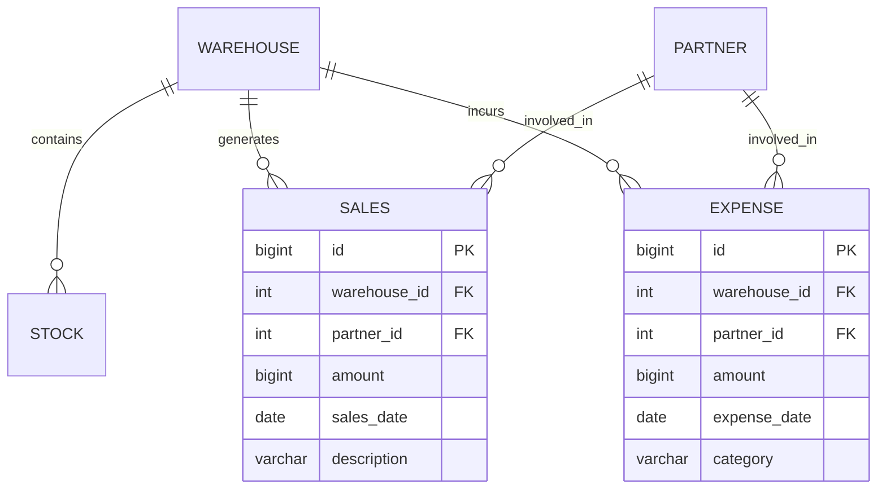

# 📦 RACL - 창고관리 시스템 (WMS)

<div align="center">


**팀명:** 빌더스 (Builders) | **팀 규모:** 6명

**개발 기간:** 2025.11.07 ~ 2025.11.14 (8일)

**담당 파트:** 📊 대시보드 시각화 & 💰 재무관리 시스템

</div>

---

## 📑 목차
- [프로젝트 소개](#-프로젝트-소개)
- [기술 스택](#-기술-스택)
- [시스템 아키텍처](#-시스템-아키텍처-architecture)
- [데이터베이스 설계 (ERD)](#-데이터베이스-설계-erd)
- [나의 담당 기능](#-나의-담당-기능)
- [트러블 슈팅 로그](#-트러블-슈팅-troubleshooting-log)
- [프로젝트 구조](#-프로젝트-구조)
- [회고](#-회고)

---

## 🎯 프로젝트 소개

**RACL**은 의류 산업에 특화된 창고관리 시스템(Warehouse Management System)입니다.

실시간 재고 추적, 입출고 관리, 데이터 시각화를 통해 효율적인 물류 운영을 지원합니다.

### 💡 기획 배경
- 의류 업계의 복잡한 SKU 관리 및 시즌별 재고 변동 대응
- 실시간 매출/비용 분석을 통한 경영 의사결정 지원
- 직관적인 대시보드로 비전문가도 쉽게 이해할 수 있는 UI 제공

### 🎨 나의 역할
저는 **관리자 대시보드 시각화**와 **재무관리(매출/지출) 시스템**을 전담하여 개발했습니다.

특히 복잡한 통계 데이터를 시각적으로 표현하고, RESTful API 구조로 확장 가능한 재무 CRUD를 구현하는 데 집중했습니다.

---

## 🛠 기술 스택

### Backend
- **Language:** Java 17
- **Framework:** Spring MVC 5.x
- **ORM:** MyBatis 3.x
- **Build Tool:** Gradle
- **WAS:** Apache Tomcat 9.0
- **Connection Pool:** HikariCP

### Frontend
- **Core:** HTML5, CSS3, JavaScript (ES6+)
- **Library:** jQuery 3.x, Bootstrap 5
- **Visualization:** ApexCharts.js 3.x

### Database
- **DBMS:** MySQL 8.x
- **Design Tool:** ERD Cloud

---

## 🏗️ 시스템 아키텍처 (Architecture)
> **Spring MVC 패턴을 기반으로 한 전체 시스템 데이터 흐름도입니다.**


- **Presentation Layer:** JSP와 Bootstrap을 활용하여 사용자 요청(Request)을 처리하고 뷰(View)를 렌더링합니다.
- **Business Layer:** Spring MVC 컨트롤러와 서비스가 비즈니스 로직을 수행합니다.
- **Persistence Layer:** MyBatis를 통해 SQL 매퍼와 객체를 매핑하여 DB 데이터를 조작합니다.

---

## 🗄️ 데이터베이스 설계 (ERD)
> **재무 관리 및 대시보드 통계를 위한 핵심 테이블 구조입니다.**


```mermaid
erDiagram
    WAREHOUSE ||--o{ STOCK : contains
    WAREHOUSE ||--o{ SALES : generates
    WAREHOUSE ||--o{ EXPENSE : incurs
    
    PARTNER ||--o{ SALES : involved_in
    PARTNER ||--o{ EXPENSE : involved_in
    
    SALES {
        bigint id PK
        int warehouse_id FK
        int partner_id FK
        bigint amount
        date sales_date
        varchar description
    }
    
    EXPENSE {
        bigint id PK
        int warehouse_id FK
        int partner_id FK
        bigint amount
        date expense_date
        varchar category
    }

```

---

## 💼 나의 담당 기능

### 1. 📊 관리자 대시보드 (Dashboard)

창고 운영의 핵심 지표를 **ApexCharts**로 시각화하여 한눈에 파악할 수 있도록 구현했습니다.

* **KPI 분석:** 연간/월간 손익 데이터를 집계하여 순이익(Net Profit)과 이익률(Profit Margin) 자동 계산
* **성장률 지표:** 전월(MoM), 전년(YoY) 대비 성장률을 산출하는 비즈니스 로직 구현
* **시각화:** Bar, Line, Radial Bar, Donut 차트를 활용한 직관적 UI 제공

### 2. 💰 재무 관리 시스템 (Sales & Expense)

창고 운영에서 발생하는 매출과 비용을 체계적으로 관리하는 CRUD 시스템입니다.

* **RESTful API:** `/api/sales`, `/api/expenses` 등 자원 중심의 URL 설계
* **데이터 무결성:** 창고(Warehouse) 및 거래처(Partner) FK 제약조건 준수 및 유효성 검사
* **필터링:** 연도/월별 동적 쿼리(Dynamic Query)를 통한 데이터 조회

---

## 🚒 트러블 슈팅 (Troubleshooting Log)

> **프로젝트 진행 중 발생한 주요 기술적 페인 포인트와 해결 전략입니다.**

<details>
<summary>👉 <b>1. 불필요한 DB Round-trip 최적화 (데이터 집계 성능 92% 개선)</b></summary>

**[Situation]**

* 연간 대시보드 진입 시, 월별 매출/지출 데이터를 각각 조회하는 Application 루프(Loop) 방식으로 인해 총 **24회의 개별 쿼리**가 발생했습니다.
* 데이터 건수가 적음에도 불구하고 불필요한 네트워크 오버헤드로 인해 약 2.5초의 로딩 지연이 발생하여 사용자 경험이 저하되었습니다.

**[Action]**

* **Set-based Operation:** 개별 조회를 집합 기반의 `GROUP BY` 쿼리로 단일화하여 DB 접근 횟수를 2회(매출/지출 각 1회)로 축소했습니다.
* **In-memory Processing:** DB에서는 로우 데이터만 집계하고, 복잡한 통계 연산은 Java Stream API를 활용하여 Application 서버로 부하를 분산했습니다.
* **Index Consideration:** 집계 조건인 `sales_date` 컬럼에 인덱스 설계를 검토하여 대용량 데이터 환경에서의 검색 성능을 고려했습니다.

```sql
/* 개선된 단일 집계 쿼리 */
<select id="selectYearlySales" resultType="SalesVO">
    SELECT MONTH(sales_date) as month, SUM(amount) as totalAmount
    FROM sales
    WHERE YEAR(sales_date) = #{year}
    GROUP BY MONTH(sales_date)
</select>

```

**[Result]**

* 쿼리 횟수 **92% 감소** (24회 → 2회) 및 로딩 속도 **0.4초**로 단축 (약 6.25배 성능 향상).

</details>

<details>
<summary>👉 <b>2. 초기 운영 단계의 지표 산출 전략 수립 (성장률 로직 안정화)</b></summary>

**[Problem]**

* 서비스 초기 혹은 전월 데이터가 부재한 상황에서 성장률(MoM) 계산 시 `ArithmeticException` (Division by Zero)이 발생하여 시스템 전체 렌더링이 중단되는 위험이 있었습니다.

**[Solution]**

* **Defensive Programming:** 수치 연산 전 분모의 유효성을 검증하는 방어 로직을 추가하여 시스템 안정성을 확보했습니다.
* **Business Strategy:** 데이터가 0인 경우를 단순히 에러로 처리하지 않고, 비즈니스 요구사항에 맞춰 '100% 성장' 혹은 '0%(현상 유지)'로 표출하는 도메인 판단 로직을 구현했습니다.
* **Precision Control:** 정밀한 재무 지표 계산을 위해 부동 소수점 오차를 고려한 데이터 타입 처리를 수행했습니다.

```java
// 전월 실적 부재 시 비즈니스 요구사항에 따른 예외 처리 전략
double growthRate = (lastMonthAmount == 0) 
    ? (currentMonthAmount > 0 ? 100.0 : 0.0) 
    : ((double)(currentMonthAmount - lastMonthAmount) / lastMonthAmount) * 100;

```

**[Result]**

* 데이터 불충분 상황에서도 런타임 에러 없이 안정적으로 대시보드 지표를 표출하여 시스템 신뢰도를 제고했습니다.

</details>

<details>
<summary>👉 <b>3. 데이터 정합성을 위한 원자적 트랜잭션 설계 (전표 번호 생성)</b></summary>

**[Problem]**

* 매출/지출 등록 시 고유 전표 번호를 생성하고 업데이트하는 과정에서, 다중 사용자의 동시 요청 시 **중복된 전표 번호가 발급될 가능성(Race Condition)**을 확인했습니다.

**[Action]**

* **Atomic Transaction:** `@Transactional`을 적용하여 'ID 생성 - 포맷팅 - 업데이트' 과정을 하나의 작업 단위(Unit of Work)로 묶어 원자성을 보장했습니다.
* **Secondary Defense:** 데이터베이스 레벨에서 해당 컬럼에 `UNIQUE` 제약 조건을 추가하여 애플리케이션 계층에서 놓칠 수 있는 중복 가능성을 원천 차단했습니다.
* **Isolation Level:** 동시성 제어와 시스템 성능 사이의 트레이드오프를 고려한 트랜잭션 설계를 진행했습니다.

```java
@Transactional(rollbackFor = Exception.class)
public void registerSales(SalesDTO salesDTO) {
    // 1. 기본 정보 저장 및 생성된 PK 획득
    salesMapper.insertSales(salesDTO);
    // 2. 고유 전표 번호 포맷팅 (SAL-YYYYMMDD-ID)
    String serialNo = generateSerialNo(salesDTO.getId());
    // 3. 전표 번호 업데이트 (원자적 정합성 보장)
    salesMapper.updateSerialNo(salesDTO.getId(), serialNo);
}

```

**[Result]**

* 재무 데이터의 핵심인 **데이터 무결성**을 확보하였으며, 동시 요청 상황에서도 중복 없는 전표 관리 시스템을 구축했습니다.

</details>

---

## 📂 프로젝트 구조

```bash
src/main/java/com/ssg/wms/
├── finance/                    # 재무관리 도메인
│   ├── controller/             # REST Controller
│   ├── service/                # Business Logic
│   ├── domain/                 # VO & DTO
│   └── mapper/                 # MyBatis Interface
├── inbound/                    # 입고관리 (타 팀원)
├── outbound/                   # 출고관리 (타 팀원)
└── common/                     # 공통 모듈
    ├── exception/              # Global Exception Handler
    └── util/                   # DateUtil, StringUtil

```

---

## 🤔 회고

### 잘한 점 (Keep)

1. **성능 최적화**: 잦은 DB 접근을 줄이고, 메모리 연산을 활용하여 응답 속도를 획기적으로 개선했습니다.
2. **시각화 품질**: 단순한 표(Table)를 넘어, ApexCharts를 활용해 경영진이 보기 편한 직관적인 대시보드를 구현했습니다.

### 아쉬운 점 (Problem)

1. **테스트 코드 부재**: 짧은 개발 기간으로 인해 단위 테스트(JUnit)를 충분히 작성하지 못해 수동 테스트에 의존했습니다.
2. **실시간성 부족**: 입출고 발생 시 대시보드가 자동으로 갱신되지 않고 새로고침을 해야 하는 한계가 있었습니다.

### 개선 방안 (Try)

1. **WebSocket 도입**: 데이터 변동 시 클라이언트에게 즉시 알림을 보내 대시보드를 자동 갱신하도록 개선하고 싶습니다.
2. **반응형 고도화**: 모바일 환경에서도 차트가 깨지지 않도록 CSS Media Query를 보완할 예정입니다.

---

## 📬 Contact

**Email:** [koo4934@gmail.com](mailto:koo4934@gmail.com)

**Portfolio:** [https://geeunii.github.io](https://geeunii.github.io)

---
