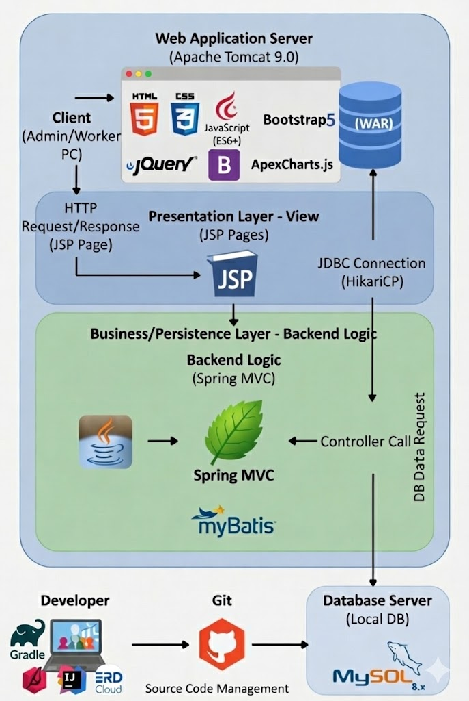
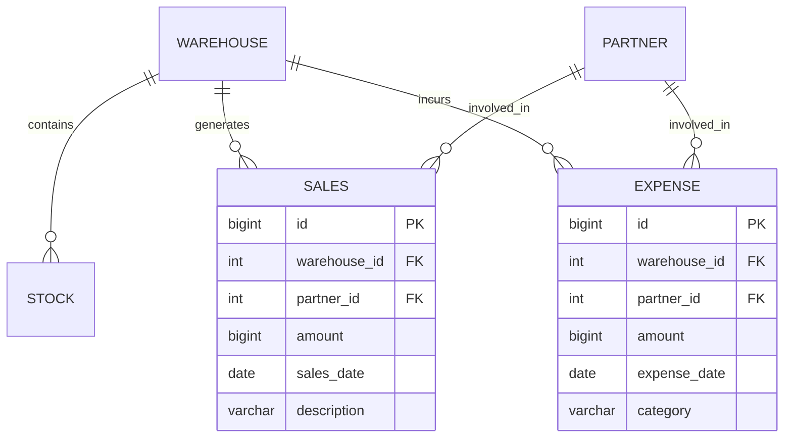

# 📦 RACL - 창고관리 시스템 (WMS)

<div align="center">


**팀명:** 빌더스 (Builders) | **팀 규모:** 6명

**개발 기간:** 2025.11.07 ~ 2025.11.14 (8일)

**담당 파트:** 📊 대시보드 시각화 및 데이터 집계 파이프라인 최적화 & 💰 재무관리 시스템

</div>

---

## 📑 목차
- [프로젝트 소개](#-프로젝트-소개)
- [기술 스택](#-기술-스택)
- [시스템 아키텍처](#-시스템-아키텍처-architecture)
- [데이터베이스 설계 (ERD)](#-데이터베이스-설계-erd)
- [나의 담당 기능](#-나의-담당-기능)
- [트러블 슈팅 로그](#-트러블-슈팅-troubleshooting-log)
- [프로젝트 구조](#-프로젝트-구조)
- [회고](#-회고)

---

## 🎯 프로젝트 소개

**RACL**은 의류 산업에 특화된 창고관리 시스템(Warehouse Management System)입니다.
실시간 재고 추적, 입출고 관리, 데이터 시각화를 통해 효율적인 물류 운영을 지원합니다.

### 💡 기획 배경
- 의류 업계의 복잡한 SKU 관리 및 시즌별 재고 변동 대응
- 실시간 매출/비용 분석을 통한 경영 의사결정 지원
- 직관적인 대시보드로 비전문가도 쉽게 이해할 수 있는 UI 제공

### 🎨 나의 역할
**관리자 대시보드 시각화**와 **재무관리 시스템**을 전담했습니다.

특히 복잡한 통계 데이터를 위한 **데이터 집계 파이프라인의 효율성**과 재무 데이터의 **무결성**을 확보하는 인프라 지향적 백엔드 설계에 집중했습니다.

---

## 🛠 기술 스택

### Backend
- **Language:** Java 17
- **Framework:** Spring MVC 5.x
- **ORM:** MyBatis 3.x
- **Connection Pool:** HikariCP (고성능 커넥션 관리)
- **Build Tool:** Gradle
- **WAS:** Apache Tomcat 9.0

### Frontend
- **Library:** JavaScript (ES6+), jQuery 3.x, Bootstrap 5
- **Visualization:** ApexCharts.js 3.x

### Database
- **DBMS:** MySQL 8.x
- **Design Tool:** ERD Cloud

---

## 🏗️ 시스템 아키텍처 (Architecture)



> **인프라 자원 효율성을 고려한 Spring MVC 패턴 기반의 데이터 흐름도입니다.**

- **Presentation Layer:** JSP와 Bootstrap을 활용하여 사용자 요청을 처리하고 뷰를 렌더링합니다.
- **Business Layer:** Spring MVC 컨트롤러와 서비스가 비즈니스 로직 및 WAS 계층의 데이터 가공을 수행합니다.
- **Persistence Layer:** MyBatis와 HikariCP를 통해 안정적이고 성능 지향적인 DB 연동을 담당합니다.

---

## 🗄️ 데이터베이스 설계 (ERD)
> **재무 관리 및 대시보드 통계를 위한 핵심 테이블 구조입니다.**


```mermaid
erDiagram
    WAREHOUSE ||--o{ STOCK : contains
    WAREHOUSE ||--o{ SALES : generates
    WAREHOUSE ||--o{ EXPENSE : incurs
    
    PARTNER ||--o{ SALES : involved_in
    PARTNER ||--o{ EXPENSE : involved_in
    
    SALES {
        bigint id PK
        int warehouse_id FK
        int partner_id FK
        bigint amount
        date sales_date
        varchar description
    }
    
    EXPENSE {
        bigint id PK
        int warehouse_id FK
        int partner_id FK
        bigint amount
        date expense_date
        varchar category
    }

```

---

## 💼 나의 담당 기능

### 1. 📊 관리자 대시보드 (Dashboard)

창고 운영의 핵심 지표를 **ApexCharts**로 시각화하여 구현했습니다.

* **KPI 파이프라인:** 연간/월간 데이터를 WAS 계층에서 효율적으로 가공하여 순이익 및 성장률 지표 산출.
* **성장률 지표:** 전월(MoM), 전년(YoY) 대비 성장률을 산출하는 방어적 비즈니스 로직 구현.
* **시각화:** 직관적인 UI 제공을 위한 다중 차트 레이아웃 설계.

### 2. 💰 재무 관리 시스템 (Sales & Expense)

창고 운영 매출과 비용을 체계적으로 관리하는 CRUD 시스템입니다.

* **RESTful API:** 자원 중심의 URL 설계를 통한 시스템 확장성 확보.
* **데이터 정합성:** FK 제약조건 준수와 @Transactional 기반의 무결성 보장.
* **필터링:** MyBatis Dynamic SQL을 활용한 연도/월별 정밀 데이터 조회.

---

## 🚒 트러블 슈팅 (Troubleshooting Log)

<details>
<summary>👉 <b>1. 불필요한 DB Round-trip 최적화 (데이터 집계 성능 92% 개선)</b></summary>

**[Situation]**

* 연간 대시보드 진입 시, 월별 데이터를 애플리케이션 루프 내에서 개별 조회(24회)하는 방식의 **Network I/O 오버헤드**로 약 2.5초의 지연 발생.

**[Action]**

* **Set-based Operation:** MyBatis 매퍼에서 `GROUP BY` 집합 연산을 활용해 DB 접근을 2회로 축소하여 **DB Round-trip**을 획기적으로 단축.
* **Resource Balancing:** 통계 가공 로직을 WAS(Java Stream API)로 이관하여 DB CPU 부하 경감 및 메모리 기반 고속 처리 구현.

```sql
/* 개선된 단일 집계 쿼리 */
<select id="findMonthlySummary" resultType="com.ssg.wms.finance.dto.DashboardSummaryDTO">
    SELECT MONTH(sales_date) AS month, SUM(amount) AS totalSales
    FROM sales
    WHERE YEAR(sales_date) = #{year}
      AND status = 'ACTIVE'
    GROUP BY MONTH(sales_date)
</select>

```

**[Result]**

* 쿼리 횟수 **92% 감소** 및 응답 속도 **0.4초**로 단축 (인프라 리소스 효율화 증명).

</details>

<details>
<summary>👉 <b>2. 초기 운영 단계의 지표 산출 전략 수립 (성장률 로직 안정화)</b></summary>

**[Problem]**

* 전월 데이터 부재 시 `ArithmeticException` 발생으로 시스템 가용성이 저해되는 리스크 확인.

**[Solution]**

* **Defensive Programming:** 수치 연산 전 유효성 검증 및 비즈니스 규칙에 따른 예외 처리 전략 구현.

```java
// 전월 실적 부재 시 비즈니스 요구사항에 따른 예외 처리 전략
double growthRate = (lastMonthAmount == 0) 
    ? (currentMonthAmount > 0 ? 100.0 : 0.0) 
    : ((double)(currentMonthAmount - lastMonthAmount) / lastMonthAmount) * 100;

```

**[Result]**

* 데이터 불충분 상황에서도 런타임 에러 없이 안정적인 지표 표출로 시스템 신뢰도 제고.

</details>

<details>
<summary>👉 <b>3. 데이터 정합성을 위한 원자적 트랜잭션 설계 (전표 번호 생성)</b></summary>

**[Problem]**

* 전표 번호 생성 시 동시 요청에 따른 **Race Condition** 및 중복 발급 가능성 확인.

**[Action]**

* **Atomic Transaction:** `@Transactional`을 적용하여 'ID 생성-포맷팅-업데이트' 과정을 하나의 원자적 작업 단위(Unit of Work)로 설계.

```java
@Override
@Transactional
public Long saveSales(SalesSaveDTO dto) {
    SalesVO salesVO = modelMapper.map(dto, SalesVO.class);
    salesMapper.save(salesVO); // 1. 기본 저장 및 PK 획득

    Long newId = salesVO.getId();
    String datePart = dto.getSalesDate().toString().replace("-", "").substring(2);
    String idPart = String.format("%05d", newId);
    String salesCode = "SAL-" + datePart + "-" + idPart;

    salesMapper.updateCode(newId, salesCode); // 2. 원자적 코드 업데이트
    return newId;
}

```

**[Result]**

* 동시 요청 상황에서도 중복 없는 데이터 관리와 **데이터 무결성** 확보.

</details>

---

## 📂 프로젝트 구조

```bash
src/main/java/com/ssg/wms/
├── finance/                    # 재무관리 도메인
│   ├── controller/             # REST Controller
│   ├── service/                # Business Logic
│   ├── domain/                 # VO & DTO
│   └── mapper/                 # MyBatis Interface
├── inbound/                    # 입고관리 (타 팀원)
├── outbound/                   # 출고관리 (타 팀원)
└── common/                     # 공통 모듈
    ├── exception/              # Global Exception Handler
    └── util/                   # DateUtil, StringUtil

```

---

## 🤔 회고 (Retrospective)

### 잘한 점 (Keep)

* **성능 엔지니어링**: 단순히 기능을 만드는 데 그치지 않고, 인프라 자원 효율을 고려한 최적화로 성능을 획기적으로 개선했습니다.

### 아쉬운 점 (Problem)

* **테스트 자동화 부족**: 짧은 기간으로 인해 인프라 장애 시나리오에 대비한 단위 테스트 비중이 낮아 수동 검증에 의존했습니다.

### 개선 방안 (Try)

* **CI/CD 파이프라인**: 향후 **GitHub Actions** 연동 및 IaC 도입을 통해 운영 환경의 일관성을 확보하고 싶습니다.

---

## 📬 Contact

**Email:** [koo4934@gmail.com](mailto:koo4934@gmail.com)

**Portfolio:** [https://geeunii.github.io](https://geeunii.github.io)

---
